

# PIC16F17146 Curiosity Nano Board Demo Code

## Introduction
This example demonstrates the working of a 12-bit Analog to Digital Converter with the Computation (ADCC) of PIC16F17146 in differential mode and single ended mode. The analog peripherals such as Operational Amplifier (OPA), Digital to Analog Converter (DAC) and Fixed Voltage Reference (FVR) can be internally connected to ADCC, thus eliminating the use of external connections. In this example, the on-board switch of PIC16F17146 Curiosity Nano is used to switch the operation of ADCC between single ended and differential mode. The DAC is used to generate a Triangular wave using a Lookup table with a frequency determined by the timer peripheral. The signal is amplified by OPA and sampled by ADCC. ADCC results are displayed in graphical format using data visualizer.

## Related Documentation
-	[PIC16F17146 Product Page](https://www.microchip.com/en-us/product/PIC16F17146)
-	[PIC16F17146 Data Sheet](https://www.microchip.com/DS40002343)

## Software Used
- MPLAB® X IDE [6.00 or newer](https://www.microchip.com/mplab/mplab-x-ide)
- Microchip XC8 Compiler [2.40 or newer](https://www.microchip.com/mplab/compilers)
- MPLAB® Code Configurator (MCC) [5.1.9 or newer](https://www.microchip.com/mplab/mplab-code-configurator)
- Microchip PIC16F1xxxx Series Device Support (DFP) [1.14.187 or newer](https://packs.download.microchip.com/)

## Hardware Used
-	[PIC16F17146 Curiosity Nano Board](https://www.microchip.com/en-us/development-tool/EV72J15A)

## Setup

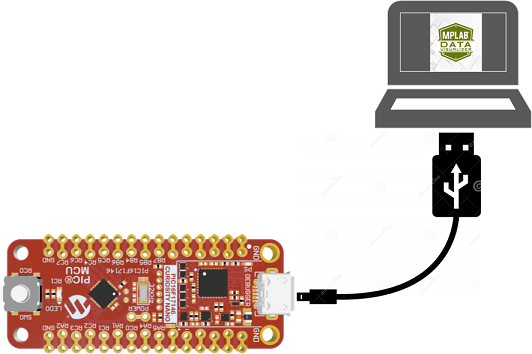

PIC16F17146 Curiosity Nano board is used as development platform. External connections are not required as all the peripherals are connected internally.

## Implementation
The implementation of this example is carried out in 4 stages.
- Generation of Triangular wave using DAC.
- Amplification of generated signal using OPA.
- Sampling of OPA output using ADCC (in either single ended or differential mode)
- Printing ADCC results in graphical format using data visualizer.

### Generation of Triangular wave
The PIC16F17146 microcontroller has 2 DAC modules. DAC1 is used to generate a triangular wave with a frequency of 1Hz. The frequency of the generated signal is decided by the DAC register update frequency which is controlled by the Timer0 interrupt. The frequency can be changed by changing the Timer0 period. The FVR is a stable voltage reference with 1.024V, 2.048V or 4.096V selectable output levels and can be configured to supply a reference voltage to analog peripherals. FVR2 Buffer provides a reference voltage of 1.024V to DAC2.

Frequency of the generated signal = 1/ (total number of points in one cycle * Timer0 period)`

The 8-bit DAC has 128 voltage level ranges, where each level is determined by the DAC register values that vary between 0-255. In one cycle of the signal, the DAC register updates between 0 to 255 and back to 0. The total number of points in one cycle of the triangular wave is the number of times the DAC register is updated in one cycle. In this example DAC register increments by 4 in each update, therefore the total number of points in one cycle will be 128.

### Amplification of signal
The generated signal is amplified using OPA with a gain of 2. OPA is configured in non-inverting amplifier mode and gain is set using internal resistor ladder feedback. The amplified signal is fed to the positive ADCC channel in both single ended and differential mode.

### ADCC Sampling
The ADCC is auto-triggered by Timer2 occurring every 2ms. The Timer2 frequency is set ten times greater than the Timer0 frequency (Frequency of DAC update). In this example, ADCC’s burst average mode is used. In this mode, the ADCC module accumulates a certain number of samples (in this case, 16 samples) sequentially at a single stretch for each auto conversion trigger and computes the average of the accumulated value. This helps in reducing the signal variation present at the input because of noise.

The on-board switch is used to change ADCC mode. The switch is connected to the External Reset Source of Timer4. It will automate the switch debouncing process using Timer4’s monostable mode of operation.

In single ended mode of ADCC, the negative ADCC channel is connected to VSS. The input at ADCC positive channel is then converted to a digital signal. In differential mode, DAC2 output is internally connected to a negative ADCC channel providing a constant voltage of 1.024V as shown in the below figure. FVR1 Buffer provides a reference voltage of 2.048V to ADCC. The ADCC measures the voltage difference between two inputs and converts the differential signal to digital output.

### Printing ADCC Results
The ADCC results are sent through UART and further displayed on the time plot window of the data visualizer. Refer [Steps to open Time Plot window in Data Visualizer](https://github.com/microchip-pic-avr-examples/pic16f17146-curiosity-nano-demo-code-mplab-mcc#steps-to-open-time-plot-window-in-data-visualizer) for viewing results in data visualizer.

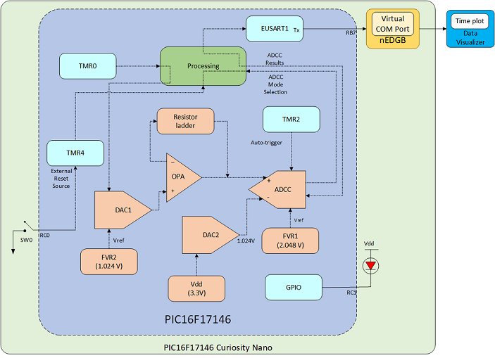

## Pin Connection Table

| Pin | Signal Description                    
| --- | -------------------                        
| RB5 |  EUSART RX
| RB7 |  EUSART TX         
| RC0 |  Switch SW0           
| RC1 |  LED0                 

### Steps to open Time Plot window in Data Visualizer
To visualize the ADCC readings in graphical format, time plot of Data Visualizer is used. Follow below mentioned procedure to open Graph/Time plot in Data Visualizer.

Open the Data Visualizer tool which is available as a plugin in MPLAB X IDE.
1.	Click on the Connections --> Serial Ports tab.
2.	Open COM7 Settings window by clicking on COM7 tab. Set the Baud Rate to 19200. Click Apply. *Note: COM port number can be different depending on the availability of port.*
3.	Click on right aligned triangle symbol on COM7 tab.
4.	Click on Variable Streamer.

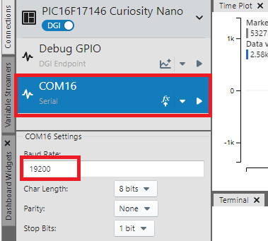

5.	Click on "New Variable Streamer".
6.	Add a new variable ADFLTR of type int16_t and Click on ‘Save’.

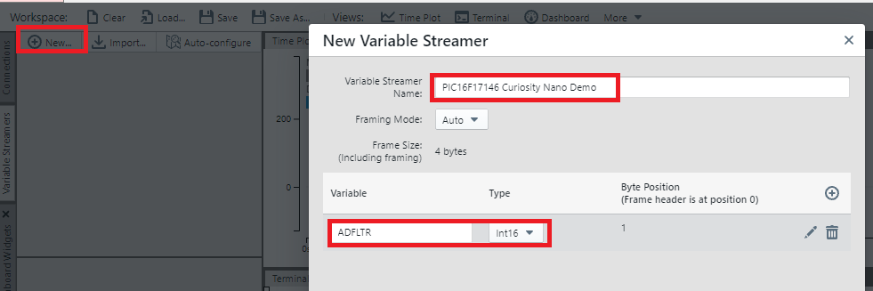

7.	Select source of the plot as COM7 port.
8.	 Add plot for ADFLTR.

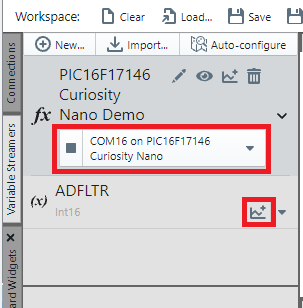

## Demo Operation
When the device is powered on, LED0 is turned ON. By default, ADCC is in differential mode. The ADCC result varies between -1024 to 1023 in differential mode.

*Note : As ADCC reference voltage is 2.048V, only half ADCC range is utilized in differential mode.*

Press the on-board switch SW0 to switch ADCC mode to single ended. LED0 is turned OFF. The ADCC result varies between 0 to 4095 in single-ended mode.

LED0 toggles on each switch press as ADCC switches between single-ended and differential mode.

### Voltage Supply Configuration

Due to a target voltage other than 3.3 V, the user might observe different ADCC output than mentioned above. For correct operation, set the target voltage to 3.3V. Target voltage can be set through the MPLAB® X IDE project properties, as shown below.

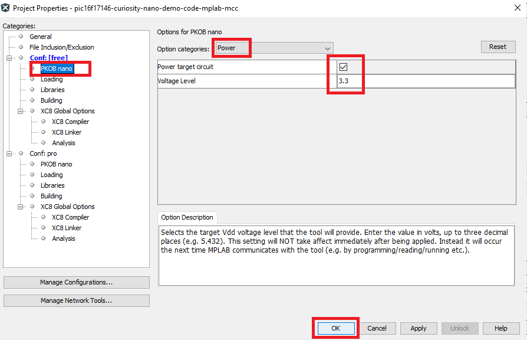

*Note : The factory default target voltage is 3.3V*

The voltage settings setup in MPLAB® X IDE is not applied immediately to the board. The new voltage setting is applied to the board when accessing the debugger, like pushing the Refresh Debug Tool Status button in the project dashboard tab or programming/reading program memory. Refer PIC16F17146 CNANO Hardware User Guide for more details.

## Peripheral Configuration using MCC
This section explains how to configure the peripherals using MPLAB X IDE with MCC plugin for recreation of the project.

Refer [Software Used](https://github.com/microchip-pic-avr-examples/pic16f17146-curiosity-nano-demo-code-mplab-mcc#software-used) section to install required tools to recreate the project.

Additional Links: [MCC Melody Technical Reference](https://onlinedocs.microchip.com/v2/keyword-lookup?keyword=MCC.MELODY.INTRODUCTION&redirect=true)

##### Peripheral Configuration Summary

|    Module                  |    Configuration                                                                                                                                                                                                                                                                                                                                                       |    Usage                                                                   |
|--------------------------------|----------------------------------------------------------------------------------------------------------------------------------------------------------------------------------------------------------------------------------------------------------------------------------------------------------------------------------------------------------------------------|--------------------------------------------------------------------------------|
|    Clock Control           |    Clock Source – HFINTOSC    HF Internal Clock – 4 MHz    Clock Divider – 1                                                                   |    System clock                                               
|    ADCC                    |    Enable ADCC    Input   Configuration – Differential Mode    Operating   Mode – Burst average Mode    Result   Alignment – Right justified, two's compliment    Positive   Reference – FVR Auto-conversion Trigger – TMR2       Clock Source – FOSC Clock Divider – FOSC/4    Threshold Interrupt Mode – enabled  Repeat – 16   Accumulator Right Shift – 4     Enable ADTI Interrupt       |    Samples OPA's output                                           |
|    DAC1                    |  Enable DAC    DAC Positive Reference Selection – FVR    DAC Negative Reference Selection – VSS          |    Generates Triangular Waveform                                           |
|    DAC2                    |  VDD – 3.3   Required ref – 1.024    Enable DAC    DAC Positive Reference Selection – FVR    DAC Negative Reference Selection – VSS        |    Connects to ADCC negative channel     
|    FVR                    |    FVR buffer 1 Gain – 2x   FVR buffer 2 Gain – 1x            |    Provides reference voltage for ADCC and DAC
|    OPA                    |    Enable Op Amp   Op Amp Configuration – Non-Inverting Programmable Gain Amplifier   Positive Channel – DAC1_OUT  Negative Channel – GSEL   Negative Source Selection – Vss   Internal Resistor Ladder Selection – R2/R1 = 1         |    Amplifies DAC output (Triangular Waveform)|
|    TMR0           |    Disable Timer    Clock Prescaler  – 1:128  Clock Source – FOSC/4 Enable   Synchronisation         Requested   Period – 0.0078 s s     Enable TMR Interrupt|    Used to update DAC1                                |
|    TMR2                   |    Disable Timer Control Mode – Roll over pulse  Start/Reset Option – Software control    Clock Source – MFINTOSC 32khz  Prescaler – 1:16  Postscaler – 1:2    Time Period – 0.002 |    Auto Triggers ADCC                                                       |
|    TMR4                   |    Enable Timer Control Mode – Monostable  Start/Reset Option – T4INPPS Start/Reset Option – Starts on rising edge on TMR4_ers   Clock Source – MFINTOSC 32kHz  Prescaler – 1:16    Time Period – 0.1    Enable TMR Interrupt |    Switch debouncing                                                   |
|    EUSART1                 |    *UART1 Driver* Requested Baudrate –   19200   UART PLIB Selector – EUSART1   *EUSART1 PLIB*      Enable Redirect   STDIO to EUSART     Enable   Receive   Enable Transmit    Enable Serial   Port                                                                                                                                                                                              |    Sends data to   Data Visualizer                                              |

##### Peripheral Configuration using MCC
###### Clock Control
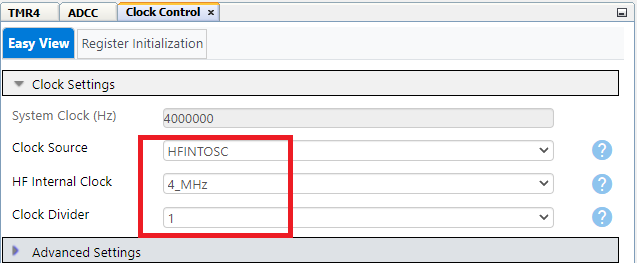

###### ADCC
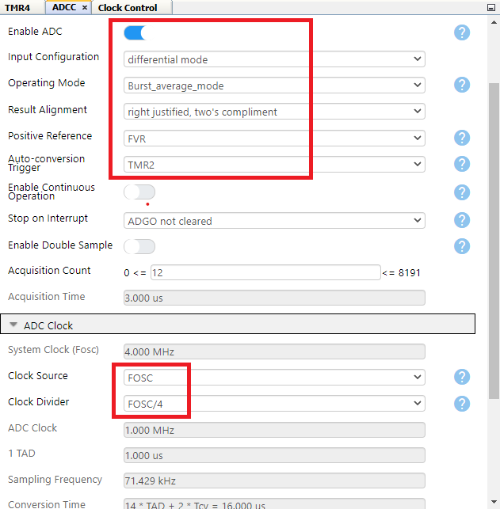
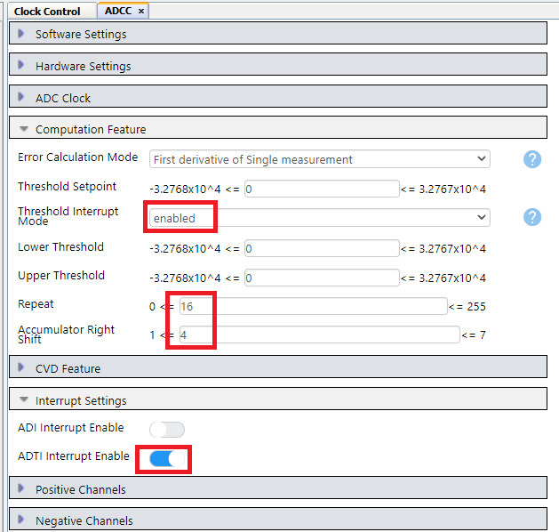

###### DAC1
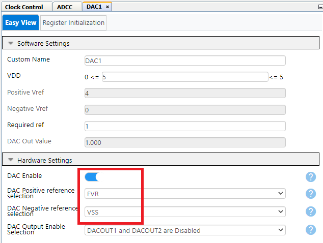

###### DAC2
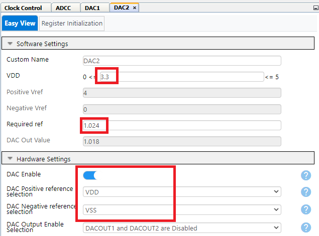

###### FVR
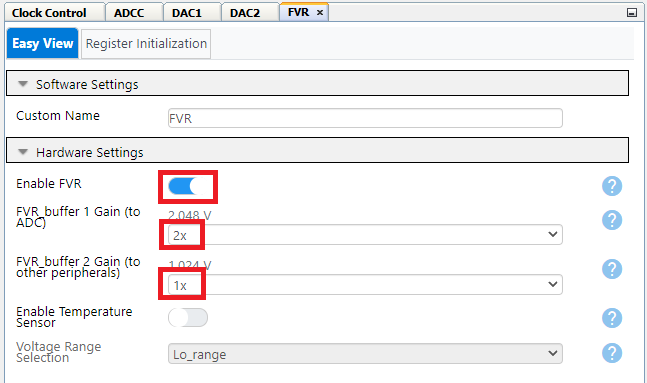

###### OPA
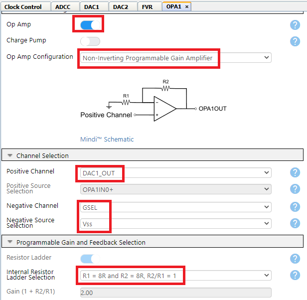

###### TMR0
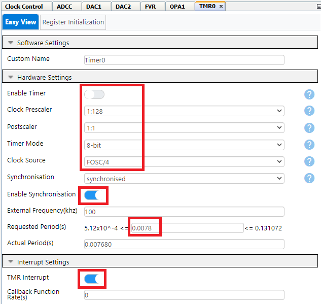

###### TMR2
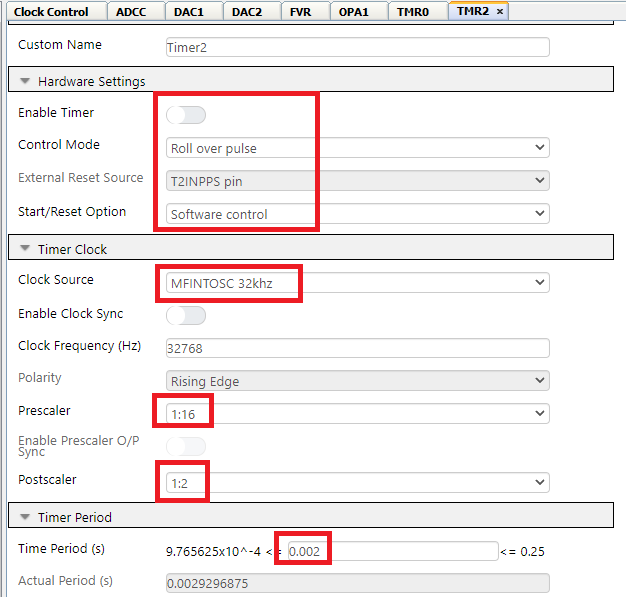

###### TMR4
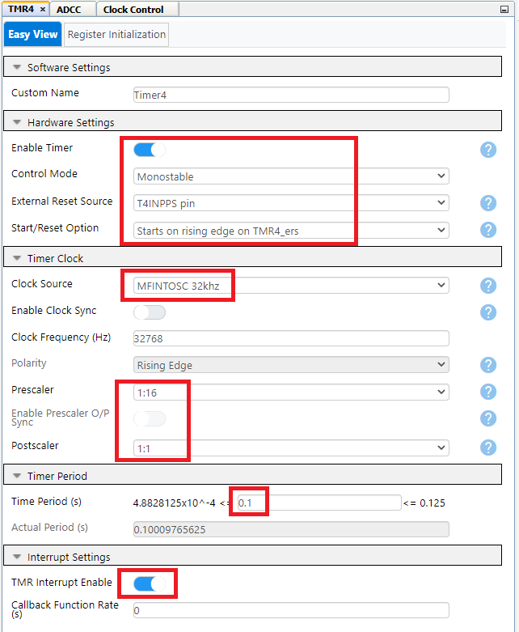

###### UART1 Driver
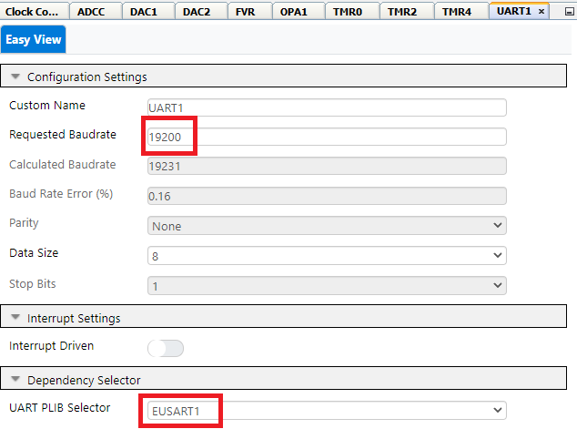

###### EUSART1 PLIB
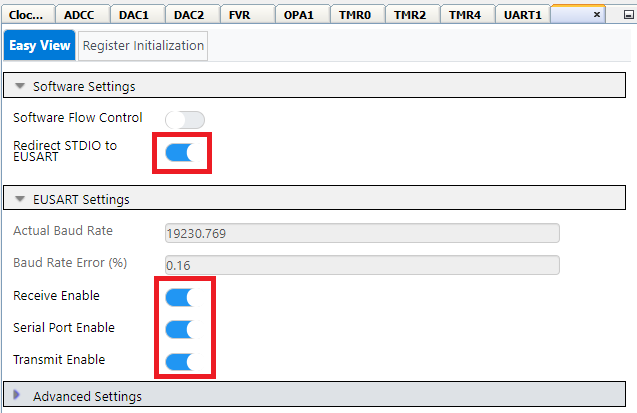

*Note: The on-board debugger present on curiosity nano board has a virtual serial port (CDC) is connected to EUSART on the PIC16F17146 and provides an easy way to communicate with the target application through terminal software. Refer curiosity nano board user guide for more details.*

###### Pins
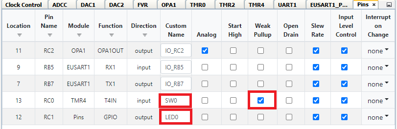

###### Pin Grid View
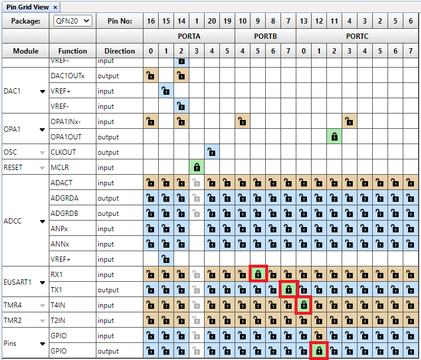

## Summary
This example demonstrates the working of 12-bit ADCC of PIC16F17146 in differential mode and single ended mode using Curiosity Nano board. The analog peripherals such as OPA, DAC and FVR can be internally connected, thus eliminating the need of external connections.
